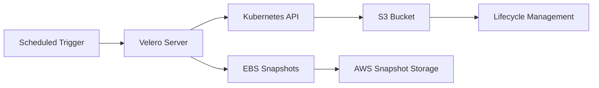

# Resilience Layer

## Purpose

The Resilience layer provides automated backup and disaster recovery capabilities for the entire Kubernetes platform. It protects against data loss, configuration corruption, and infrastructure failures by creating scheduled backups of both application data and cluster state.

## Components

### Backup Infrastructure
- **S3 Bucket**: Encrypted storage for Kubernetes configurations and metadata
- **EBS Snapshots**: Point-in-time copies of persistent volumes
- **IAM Role**: Minimal permissions for backup operations via IRSA
- **Lifecycle Policies**: Automatic cost optimization (IA after 30 days, Glacier after 90 days)

### Velero Deployment
- **Velero Server**: Orchestrates backup and restore operations
- **Node Agent**: Handles file-level backups on worker nodes
- **AWS Plugin**: Integrates with EBS snapshots and S3 storage

### Backup Schedules
- **Daily** (2 AM): EBS snapshots, 30-day retention
- **Weekly** (Sunday 3 AM): Full backup with file-level copies, 90-day retention
- **Monthly** (1st at 4 AM): Complete disaster recovery backup, 365-day retention

## How It Works

### Backup Process


1. **Scheduled backups** trigger Velero operations
2. **Kubernetes configs** are extracted via API and stored in S3
3. **Persistent volumes** are snapshot using EBS native capabilities
4. **Metadata** links snapshots to Kubernetes resources
5. **Lifecycle policies** automatically manage storage costs

### Restore Process
```bash
# List available backups
velero backup get

# Restore specific namespace
velero restore create --from-backup daily-backup-20250110 --include-namespaces app-namespace

# Full cluster restore
velero restore create --from-backup monthly-dr-backup-20250101
```

## What Gets Backed Up

### Application Data
- Database volumes (PostgreSQL, MySQL data files)
- File uploads and user content
- Application logs and temporary files
- Monitoring data (Prometheus, Grafana)

### Cluster Configuration
- Deployments, Services, ConfigMaps
- Secrets (encrypted)
- RBAC policies and permissions
- Ingress rules and network policies
- Custom resources (ArgoCD apps, certificates)

## Disaster Recovery Scenarios

| Scenario | Recovery Method | RTO | RPO |
|----------|----------------|-----|-----|
| Pod failure | Kubernetes self-healing | < 1 min | None |
| Volume corruption | EBS snapshot restore | 5-10 min | 24 hours |
| Namespace deletion | Velero namespace restore | 2-5 min | 24 hours |
| Cluster corruption | Full cluster restore | 15-30 min | 24 hours |
| Region failure | Cross-region restore | 30-60 min | 24 hours |

## Production Readiness

### ✅ Current Production Features
- Encrypted backup storage with access controls
- Automated lifecycle management for cost optimization
- Multiple backup schedules with appropriate retention
- IRSA integration for secure AWS access
- Monitoring metrics endpoint available

### ⚠️ Production Enhancements Needed

#### High Priority
1. **Cross-Region Backup Replication**
   ```hcl
   # Add to S3 bucket configuration
   replication_configuration {
     role = aws_iam_role.s3_replication.arn
     rules {
       id     = "disaster-recovery"
       status = "Enabled"
       destination {
         bucket        = "backup-bucket-dr-region"
         storage_class = "STANDARD_IA"
       }
     }
   }
   ```

2. **Backup Validation Testing**
   ```yaml
   # Add automated restore testing
   apiVersion: v1
   kind: CronJob
   metadata:
     name: backup-validation
   spec:
     schedule: "0 6 * * 1"  # Weekly validation
   ```

3. **Monitoring Integration**
   ```yaml
   # Enable ServiceMonitor in Velero values
   metrics:
     serviceMonitor:
       enabled: true
       additionalLabels:
         release: kube-prometheus-stack
   ```

#### Medium Priority
4. **Backup Encryption at Rest**
   - Enable KMS encryption for S3 bucket
   - Configure EBS snapshot encryption

5. **Alerting Rules**
   ```yaml
   # Prometheus rules for backup failures
   - alert: VeleroBackupFailed
     expr: velero_backup_failure_total > 0
     for: 5m
   ```

6. **Disaster Recovery Runbook**
   - Document step-by-step recovery procedures
   - Define RTO/RPO targets per service
   - Establish communication protocols

#### Low Priority
7. **Cost Optimization**
   - Implement backup deduplication
   - Fine-tune retention policies per namespace
   - Consider Glacier Deep Archive for long-term retention

8. **Advanced Features**
   - Backup hooks for application consistency
   - Selective backup policies per workload
   - Integration with change management systems

## Monitoring

### Key Metrics to Track
- `velero_backup_success_total`: Successful backup count
- `velero_backup_failure_total`: Failed backup count
- `velero_backup_duration_seconds`: Backup completion time
- `velero_restore_success_total`: Successful restore count

### Recommended Alerts
- Backup failures (immediate)
- Backup duration exceeding SLA (warning)
- S3 bucket access issues (critical)
- EBS snapshot quota approaching limit (warning)

## Cost Estimation

### Monthly Costs (Approximate)
- **S3 Standard**: $0.025/GB for first 30 days
- **S3 IA**: $0.0125/GB after 30 days
- **S3 Glacier**: $0.004/GB after 90 days
- **EBS Snapshots**: $0.05/GB (incremental)

### Example for 100GB data:
- Month 1: ~$15 (Standard + snapshots)
- Month 2-3: ~$8 (IA + snapshots)
- Month 4+: ~$5 (Glacier + snapshots)

## Testing Recovery

### Regular Testing Schedule
```bash
# Monthly: Test namespace restore in staging
velero restore create test-restore --from-backup daily-backup-latest --include-namespaces test-app

# Quarterly: Full cluster restore in DR environment
velero restore create dr-test --from-backup monthly-dr-backup-latest

# Annually: Cross-region disaster recovery drill
```

## Usage Examples

### Manual Backup Before Major Changes
```bash
# Create one-time backup before deployment
velero backup create pre-deployment-backup --include-namespaces production
```

### Restore After Accidental Deletion
```bash
# Restore specific deployment
velero restore create fix-deletion --from-backup daily-backup-20250110 \
  --include-resources deployments --selector app=ecommerce
```

### Debug Backup Issues
```bash
# Check backup logs
velero backup logs daily-backup-20250110

# Describe backup details
velero backup describe daily-backup-20250110
```