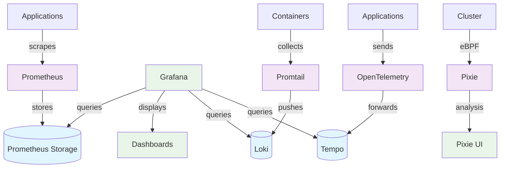

# Production-Ready Kubernetes Platform on AWS

This repository contains a complete production-ready platform for deploying applications on AWS using Kubernetes, built with Terraform and following GitOps principles.

## 📋 Table of Contents

- [Overview](#overview)
- [Prerequisites](#prerequisites)
- [Architecture](#architecture)
  - [Layer Structure](#layer-structure)
- [🏗️ Layer 1: Foundation](#️-layer-1-foundation)
  - [Components](#components)
  - [Deployment](#deployment)
  - [Understanding .terraform.lock.hcl](#understanding-terraformlockhcl)
  - [Post-Deployment](#post-deployment)
- [🔧 Layer 2: Platform](#-layer-2-platform)
  - [Secret Management Options](#secret-management-options)
  - [Step 02: Software Installation](#step-02-software-installation)
  - [Step 03: Software Configuration](#step-03-software-configuration)
    - [DNS Configuration](#1-dns-configuration)
    - [Certificate Management](#2-certificate-management)
    - [Secret Management Configuration](#3-secret-management-configuration)
  - [Hosted Zones](#hosted-zones)
- [📊 Layer 3: Observability and Monitoring](#-layer-3-observability-and-monitoring)
  - [Components](#components-1)
  - [Data Flow](#-observability-data-flow)
  - [Overview](#overview-1)
  - [Details](#details)
- [🚀 Application Deployment](#-application-deployment)
  - [Components](#components-2)
    - [Creates Namespace](#1-creates-namespace)
    - [ArgoCD Application](#2-argocd-application)
    - [Ingress with TLS](#3-ingress-with-tls)
    - [External Secret](#4-external-secret)
  - [End Result](#end-result)
  - [How It Works](#how-it-works)
  - [Deployment](#deployment-1)
- [🌐 Traffic Flow](#-traffic-flow)
- [🔧 Troubleshooting](#-troubleshooting)
  - [Common Issues](#common-issues)
  - [Useful Commands](#useful-commands)
- [✨ Best Practices Implemented](#-best-practices-implemented)
- [🤝 Contributing](#-contributing)
- [📄 License](#-license)

---

## Overview

The platform uses **Terraform** to create and manage infrastructure, making provisioning easier and more reproducible. It's built in layers to address Terraform's dependency management challenges (DAG issues) and follows best practices for state management using external storage like S3.

## Prerequisites

Before getting started, ensure you have:

1. **Terraform CLI** - [Installation Guide](https://learn.hashicorp.com/tutorials/terraform/install-cli)
2. **AWS CLI** - Properly configured with credentials

## Architecture

The platform is organized into **layers**, each containing:
- `main.tf` - Resource definitions
- `providers.tf` - Provider versions and API configurations

### Layer Structure

```
├── foundation/          # Core infrastructure
├── platform/           # Kubernetes platform components
│   ├── step02/         # Software installation
│   └── step03/         # Software configuration
└── app/                # Application deployment
```

## Layer 1: Foundation

Creates the core infrastructure components required for any Kubernetes cluster.

### Components

- **VPC** - Virtual Private Cloud for network isolation
- **Subnets** - Public, private, and intra subnets across availability zones
- **IAM** - Identity and Access Management roles and policies
- **DNS** - Route53 hosted zone configuration
- **Cluster** - A collection of worker nodes and control plane (basically Kubernetes cluster)
- **NAT Gateway** - Outbound internet access for private subnets

### Deployment

```bash
cd foundation/
terraform init
terraform apply
```

### Understanding .terraform.lock.hcl

The `.terraform.lock.hcl` file is Terraform's dependency lock file. It:

- **Locks provider versions** - Records the exact versions of providers that were downloaded
- **Ensures consistency** - Makes sure everyone on your team uses the same provider versions
- **Prevents drift** - Stops providers from auto-updating to newer versions unexpectedly
- **Contains checksums** - Verifies provider authenticity and integrity

**Should you commit it?** Yes, always commit it to version control.

**When is it created?** During `terraform init` when providers are downloaded.

Example content:
```hcl
provider "registry.terraform.io/hashicorp/aws" {
  version = "5.0.0"
  hashes = [
    "h1:xyz123...",
    "zh:abc456...",
  ]
}
```

It's similar to `package-lock.json` in Node.js or `Pipfile.lock` in Python - it locks your dependencies to specific versions for reproducible builds.

### Post-Deployment

After running `terraform apply`, all resources should be created on AWS. Now run:

```bash
aws eks update-kubeconfig --region [YOUR_REGION] --name [CLUSTER_NAME]
```

This downloads the certificate that allows us to communicate with the API via kubectl. Then we can run:

```bash
kubectl get nodes
```

to check the nodes (internal Kubernetes nodes).

## Layer 2: Platform

Split into two steps: **Step02** (installing the software with basic config) and **Step03** (configuring the software).

This layer consists of the components needed for Kubernetes to be ready for production - they are defined as Helm charts:

1. **Gateway/Ingress (Ingress Nginx)** - For routing traffic inside the cluster
2. **Secret Management (External Secret Operator)** - For syncing secrets in a secure way
3. **Certificate Management (Cert Manager)** - For TLS certificate issuance
4. **Continuous Delivery (ArgoCD)** - Deploying the application with the GitOps pattern
5. **Cluster Autoscaling**

### Secret Management Options

We can handle secrets in our cluster in three different ways:

1. **Using secret manager** [Recommended] like Vault, and when the container is spun up, we query vault for the secrets, then inject them in the container.

2. **Sealed secrets**, where we encrypt the secrets and put them in our YAML manifests, and these encrypted values are committed in our git repo. [No secret manager is needed here - secret rotation is handled manually]

3. **External secret operator** [Implemented] is running inside the cluster, it is a resource that we can use to make it point to a store (KeyVault, AWS parameters, ...) - And we commit a reference to this secret in our YAML manifests (in the app)

### Step 02: Software Installation

**Note**: In the ingress resource, we set `enableHttp: true` for the cert-manager to be able to issue certificates.

**Good read on AWS load balancer types**: [Network vs Application LB](https://aws.amazon.com/compare/the-difference-between-the-difference-between-application-network-and-gateway-load-balancing/)

**ArgoCD** is a GitOps tool that monitors git, and once it sees a change (in code or config, depends how it was set up), it will deploy and update the cluster.

```bash
cd platform/step02/
terraform init
terraform apply
```

### Step 03: Software Configuration

In Step03 we will configure:

#### 1. DNS Configuration
Create a DNS record in the hosted zone on AWS Route53, and make it point to our cluster's ingress.

This means we have a domain, and we want to map this domain to our ingress's IP.

```bash
kubectl -n ingress-nginx get svc
```

You can see the ingress IP from this command.

#### 2. Certificate Management
Configure `cert-manager` to create TLS certificates (Let's Encrypt is used for issuing the cert).

**Automatic SSL**: When you create an Ingress with TLS, cert-manager will automatically:
1. Request a certificate from Let's Encrypt
2. Serve the challenge file via nginx
3. Get the certificate and store it in Kubernetes
4. Auto-renew before expiration

#### 3. Secret Management Configuration
Configure the secrets manager → external-secrets operator can fetch certificates/secrets from AWS Parameter Store.

A service account named `secret-store` (assuming the role created in foundation) will be created, and a ParameterStore as a secrets store.

**Automatic Secret Sync**: You can now create ExternalSecret resources that:
1. Reference secrets stored in AWS Parameter Store
2. Automatically sync them to Kubernetes secrets
3. Keep them updated when Parameter Store values change

```bash
cd platform/step03/
terraform init
terraform apply
```

### Hosted Zones

Hosted zones are AWS's way of organizing and managing all DNS records for a domain in one place.

```
Hosted Zone: terraform-aws-platform.xyz
├── A Record: terraform-aws-platform.xyz → 192.168.1.100
├── CNAME Record: app.terraform-aws-platform.xyz → load-balancer.aws.com
├── MX Record: mail.terraform-aws-platform.xyz → mail-server.com
├── NS Records: (nameservers that handle this zone)
└── SOA Record: (zone authority information)
```

## Layer 3: Observability and Monitoring

This part installs and configures many tools to help us monitor and check our cluster overall health.

### Components:
1. Visualization (Grafana)
2. Logging (Grafana Loki)
3. Metrics (Prometheus)
4. Auto-instrumented Tracing (Pixie)
5. Tracing (Grafana Tempo & Open Telemetry)

### 🔄 Observability Data Flow:



### Overview
 cluster probably needs the EBS CSI driver for dynamic volume provisioning
 
 ```kubectl apply -k "github.com/kubernetes-sigs/aws-ebs-csi-driver/deploy/kubernetes/overlays/stable/?ref=release-1.25"```
 
Automatic Data Collection (No Code Changes):

Prometheus: Infrastructure metrics (CPU, memory, network)
Loki + Promtail: All application logs automatically
Pixie: HTTP traffic, database queries, service maps (eBPF magic!)

Requires Instrumentation:

Tempo + OpenTelemetry: Distributed tracing (needs SDK integration)

### Details:

Please head to the RAEDME file inside the `04_observability` folder for a more in depth insights about the tools and the over all architecture.

## Application Deployment

In the `100_app` directory we have `main.tf` file which is responsible for deploying Google's Microservices Demo App.

### Components

#### 1. Creates Namespace
```hcl
resource "kubernetes_namespace_v1" "onlineboutique"
```

Creates `onlineboutique` namespace for the application.

#### 2. ArgoCD Application
```hcl
resource "kubernetes_manifest" "app_chart"
```

- Deploys Google's Online Boutique microservices demo via ArgoCD
- Uses Helm chart from Google's container registry
- Auto-sync enabled: ArgoCD automatically applies changes and heals drift
- Frontend config: Sets `externalService: false` (uses ingress instead of LoadBalancer)

#### 3. Ingress with TLS
```hcl
resource "kubernetes_ingress_v1" "frontend"
```

- Exposes the frontend service at `app.terraform-aws-platform.xyz`
- Auto SSL: cert-manager automatically gets Let's Encrypt certificate
- Routes: All traffic to the frontend service on port 80

#### 4. External Secret
```hcl
resource "kubernetes_manifest" "cluster_secret_store"
```

- Syncs secret from AWS Parameter Store (`cluster-prod-k8s-platform-tutorial-secret`)
- Creates Kubernetes secret named `onlineboutique-custom-secret`
- Auto-refresh: Updates every hour

### End Result

**Complete e-commerce demo**: A fully functional microservices application with:

- **Public access**: `https://app.terraform-aws-platform.xyz` (SSL-enabled)
- **GitOps**: Managed by ArgoCD
- **Secret management**: AWS Parameter Store integration
- **Production-ready**: Ingress, TLS, namespace isolation

### How It Works

#### 1. ArgoCD Deploys the App
```yaml
source:
  repoURL: us-docker.pkg.dev/online-boutique-ci/charts
  chart: onlineboutique
```

This Helm chart creates multiple services: `frontend`, `cartservice`, `paymentservice`, `productcatalogservice`, etc.

#### 2. The "frontend" Service Gets Created
When the Online Boutique chart deploys, it creates a service named `frontend` that looks like:

```yaml
apiVersion: v1
kind: Service
metadata:
  name: frontend        # <-- This is the actual service name
  namespace: onlineboutique
spec:
  ports:
  - port: 80
  selector:
    app: frontend
```

#### 3. Ingress References the Real Service
```yaml
backend {
  service {
    name = "frontend"    # <-- Must match the actual service name
    port {
      number = 80
    }
  }
}
```

#### 4. You Can Verify This
After deployment, run:

```bash
kubectl get services -n onlineboutique
```

You'll see services like:
- `frontend`
- `cartservice`
- `paymentservice`
- etc.

### Key Point

**The ingress backend service name must match an existing Kubernetes service.** Since Google's Online Boutique creates a service called `frontend`, that's what you reference in the ingress.

If you tried to use `name = "my-random-name"`, the ingress would fail because that service doesn't exist.

### Deployment

```bash
cd app/
terraform init
terraform apply
```

## Traffic Flow

```
User (https://app.terraform-aws-platform.xyz)
    ↓
DNS Resolution (Route53)
    ↓
AWS Load Balancer
    ↓
Ingress Controller (nginx)
    ↓
Frontend Service
    ↓
OnlineBoutique Pods
```

## Troubleshooting

### Common Issues

1. **DNS Resolution Problems**
   - Verify nameserver configuration at domain registrar
   - Check Route53 hosted zone records

2. **Certificate Issues**
   - Ensure HTTP traffic is enabled for cert-manager validation
   - Verify domain ownership and DNS propagation

3. **Ingress Controller Issues**
   - Check load balancer provisioning
   - Verify security group configurations

### Useful Commands

```bash
# Check cluster status
kubectl get nodes

# Check ingress controller
kubectl -n ingress-nginx get svc

# Check certificates
kubectl get certificates -A

# Check ArgoCD applications
kubectl -n argocd get applications
```

## Best Practices Implemented

- **Infrastructure as Code**: Everything defined in Terraform
- **Layered Architecture**: Clear separation of concerns
- **Secret Management**: External secret synchronization
- **Certificate Management**: Automatic SSL/TLS provisioning
- **State Management**: Remote state storage in S3
- **GitOps**: Automated deployments via ArgoCD

## Contributing

1. Fork the repository
2. Create a feature branch
3. Make changes following the established patterns
4. Test thoroughly in a development environment
5. Submit a pull request

## License

This project is licensed under the MIT License - see the LICENSE file for details.